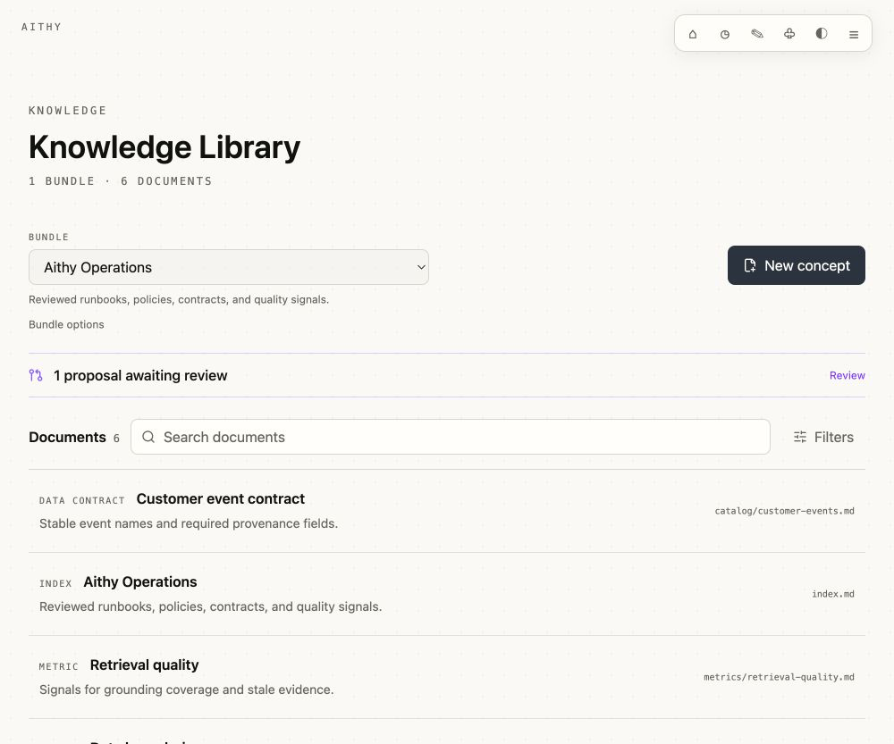
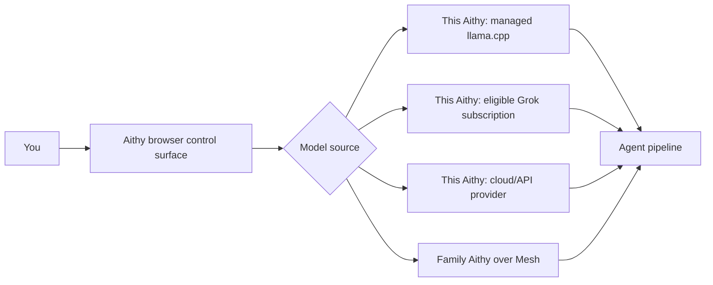
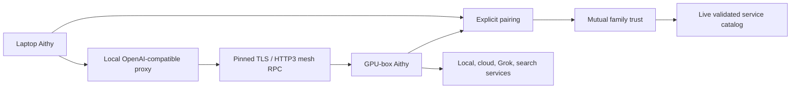
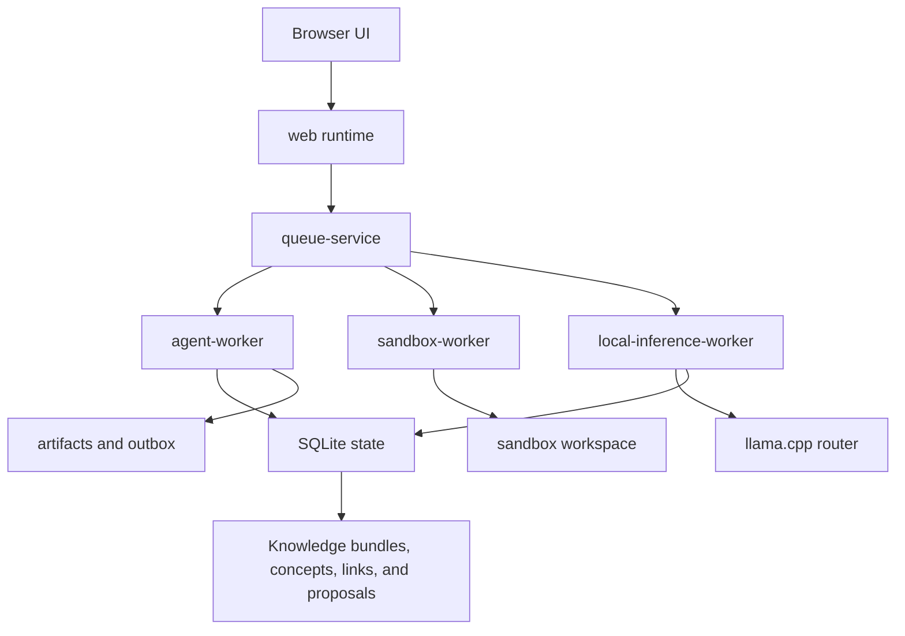

# Aithy

```text
      ..:::::..
   .:+#########+:.
  :###=:....:=###:
 .##+  AITHY   +##.
 :##  local AI  ##:
 .##+  //////  +##.
  :###=::::=###:
   .:+#####:+.
      ':::'
```

Aithy is a private local AI runtime: easy to run, inspectable in the browser, and ready for local models, cloud providers, eligible Grok subscriptions, and Mesh-shared home GPUs.

It is pronounced **ay-thee**. It is named after my cat.

Aithy is useful as a personal agent today, but it is also built for the messy place where agent research becomes real software: durable sessions, sandboxed tools, local inference, retrieval, memory, skills, background work, and multiple supervised services running together in an inspectable local product.

## Why Aithy

- **Run it locally.** Start Aithy, open the browser control surface, and use an inspectable agent workspace without wiring an agent framework by hand.
- **Use the models you already have.** Choose managed local `llama.cpp` models, normal cloud/API providers, custom OpenAI-compatible endpoints, or an eligible Grok subscription.
- **Make your Grok subscription useful.** Grok subscription sign-in can power chat and `web.search` without pasting an API key into Aithy. For people who already pay for Grok, that can avoid setting up separate per-token API-key billing for supported usage, subject to xAI eligibility and limits.
- **Share a stronger machine.** Pair Aithy on your laptop with Aithy on a GPU box over LAN Mesh, then use validated family inference/search services without copying secrets around.
- **Keep the agent visible.** Sessions, memory, skills, attentions, artifacts, usage, permissions, training-data capture, sandbox state, and runtime services are part of the product, not hidden logs. Chat streams assistant responses, shows model-reported progress, and keeps inline artifacts and explicit approval bubbles visible while work is happening.

## Quick Start

### Download a build

Download the latest packaged build from [GitHub Releases](https://github.com/dosco/aithy/releases/latest), choose the archive for your OS, unpack it, and run Aithy:

```bash
gh release download --repo dosco/aithy --pattern 'aithy-*-darwin-arm64.tar.gz'
tar -xzf aithy-*-darwin-arm64.tar.gz
cd aithy-*-darwin-arm64
./aithy
```

Open `http://127.0.0.1:3000`. Use `--host` and `--port` if you want a different bind address.

Release archives are named by platform:

- `aithy-v*-darwin-arm64.tar.gz` for Apple Silicon Macs.
- `aithy-v*-linux-x64-gnu.tar.gz` for Linux x64.
- `aithy-v*-linux-arm64-gnu.tar.gz` for Linux ARM64.

Intel Mac and Windows archives are not published yet because the packaged sandbox runtime is not available for those targets.

### Start from code

Use this path if you want to run from the repo, hack on Aithy, or follow the code as it changes. You need [Bun](https://bun.sh/) 1.4.0 or newer.

```bash
bun install
bun run start
```

The welcome screen walks through your profile, provider, model, key or sign-in flow, sandbox settings, and local inference options.

Local state lives at `~/.config/aithy/default/` by default. Use the web UI and persisted settings for provider-scoped model profiles, search profiles, secrets, sandbox settings, Mesh, and local inference.

Every Aithy is a full Aithy. There is no separate inference-only daemon: to share a GPU box with laptops on the same LAN, run Aithy on each machine, open Mesh, pair them, and mark the relationship level you actually trust.

## Packaged Releases

Pushing a `v*` tag runs the GitHub Actions release flow. It checks the repo, builds the production web app, packages supported portable archives, smoke-tests the Linux x64 package, and attaches archives plus SHA-256 checksums to the GitHub release.

Each archive contains one pinned Bun runtime, bundled app JavaScript, built client assets, a target-specific native vendor slice, and external worker bundles only for sandbox and local inference. The packaged `aithy` command runs the web runtime, queue service, and agent/background queues inside one coordinator process while keeping `sandbox-worker` and `local-inference-worker` as supervised child processes.

## Screenshots

These light-mode screenshots are captured from the real app with a disposable local profile, demo-safe runtime and usage records, and no real credentials.

<p>
  
</p>

<table>
  <tr>
    <td><br><sub>Chat with tools, files, and visible runtime evidence</sub></td>
    <td><br><sub>Choose local, cloud, Grok, or family model sources</sub></td>
    <td><br><sub>Run chat, embeddings, reranking, and retrieval locally</sub></td>
  </tr>
  <tr>
    <td><br><sub>Use Grok subscription sign-in without an API key paste</sub></td>
    <td><br><sub>Pair local Aithys and share trusted services</sub></td>
    <td><br><sub>Watch services, queues, jobs, and logs</sub></td>
  </tr>
  <tr>
    <td><br><sub>See model recommendations by task component</sub></td>
    <td><br><sub>Teach repeatable workflows and reusable abilities</sub></td>
    <td><br><sub>Tune the surface without changing the agent</sub></td>
  </tr>
  <tr>
    <td><br><sub>Curate DB-backed knowledge and exchange reviewed OKF bundles</sub></td>
    <td></td>
    <td></td>
  </tr>
</table>

## Use the Models You Already Have

Aithy lets the model source be a runtime choice instead of a project rewrite.



Local inference uses a managed `llama.cpp` `llama-server` release pinned in `package.json`, with Qwen GGUF chat models plus local Qwen embedding and reranker models. A saved path to your own compatible `llama-server` can be used instead.

If the Runtime Console shows `local-inference-worker` as `DEGRADED`, the local router for local chat, memory embeddings, or reranking is unavailable or recovering. Cloud-provider chat can still work when Local is not selected, and the console shows the current error plus any automatic retry countdown.

The Grok subscription provider uses OAuth/PKCE sign-in. Tokens stay in local Aithy secrets, and the connected provider can be used for chat and `web.search` when the subscription is eligible for the underlying xAI access.

## Share Inference With Mesh

Aithy Mesh is for the home-lab shape a lot of local AI users already have: a laptop where you work, and a stronger machine somewhere nearby.



Mesh discovery is LAN-only. It advertises identity and connection metadata, not model lists, provider URLs, API keys, prompts, sessions, memories, or service catalogs. Family catalogs are live RPC calls, only mutual `family` peers can return them, and shared providers are never recursively re-shared.

## Built for Real Agent Work

Aithy is not just a chat box with a pile of tools. It treats the agent as a local runtime system.

Assistant responses stream into the active chat as they are generated. When the agent needs structured input, the latest clarification can render choices, a date field, or a number field; the selected labels are sent as an ordinary next turn and remain visible in the durable transcript.



The runtime services are `web`, `queue-service`, `agent-worker`, `sandbox-worker`, and `local-inference-worker`. In source/dev mode they run as separate supervised processes. In packaged releases, `web`, `queue-service`, and `agent-worker` share the coordinator process, while sandbox and local inference stay outside that process for native dependency and safety boundaries.

Under the hood, Aithy uses Ax and Ax Agent with an RLM-style, DSPy-inspired flow: context distillation, JavaScript runtime execution, and final response generation. Deterministic work such as parsing, filtering, sorting, deduping, retrieval orchestration, and tool routing can happen in code while the model focuses on language, judgment, and response quality.

MCP fits this shape naturally. Settings -> MCP can connect streamable HTTP or legacy HTTP+SSE servers. Each enabled server is lazily initialized, unavailable servers are omitted without failing unrelated chat, and remote tools are namespaced and permission-gated per server and exact tool. Tokens stay in Bun secrets; loopback and unencrypted HTTP targets require explicit exceptions, while remote descriptions and results are bounded and treated as untrusted data. Prompts and resources remain hidden unless enabled for that profile.

Aithy can also expose its own read-only MCP endpoint at `http://127.0.0.1:3111/mcp` (default off). Enabling it generates a bearer token shown once; regeneration similarly shows only the replacement once. It exposes `memory.search`, `knowledge.search`, `knowledge.read`, `skills.list`, `skills.read`, `artifacts.list`, and `artifacts.read`. MCP memory and knowledge searches do not mutate retrieval counters, skill reads do not change usage counters, and artifact reads return stored metadata/text previews rather than arbitrary files. These loopback-only, bearer-authenticated, read-only server tools sit outside agent permission governance because they cannot perform agent actions or writes. OAuth and `session.ask` are deferred.

## Knowledge, Memory, Skills, Episodes, and Artifacts

Aithy's Knowledge Library is the curated, reusable source for organization and project facts: schemas, policies, metrics, runbooks, APIs, references, and provenance. SQLite is canonical. Bundles, concepts, links, chunks, vector metadata, and review proposals live in the per-bot `state.db`; OKF v0.1 is reviewed import/export interchange, not a second live store.

The product surfaces are deliberately separate:

- **Knowledge** is reviewed domain evidence with types, tags, resources, citations, links, backlinks, timestamps, and stable bundle paths.
- **Memory** preserves user/project continuity, preferences, decisions, and operational lessons across conversations.
- **Skills** describe reusable procedures and tool workflows.
- **Episodes (Dreams)** record completed work so retrieval can reuse prior approaches and outcomes.
- **Artifacts** are files and deliverables produced for the user.

Open Knowledge after Memory to create manual bundles and concepts, enable or disable a bundle for agent retrieval, search and filter concepts, inspect rendered Markdown and provenance, and review pending agent proposals. Folder import validates an OKF snapshot before saving: it reports added, changed, removed, invalid, and broken-link counts, then replaces an imported bundle atomically only after removals are confirmed. Export downloads `<slug>-okf.tar.gz`; manual bundles synthesize a root `index.md`, while imported frontmatter and reserved `index.md`/`log.md` files round-trip semantically.

Concepts are split at Markdown heading and paragraph boundaries into roughly 2,000-character chunks, indexed by SQLite FTS5 and sqlite-vec when available, and ranked one result per concept. Each chat turn receives at most three matching summaries and 1,800 total characters in a separate knowledge context; full bodies require `knowledge.read`. The permission-exempt `knowledge.search`, `knowledge.read`, and `knowledge.list` tools are bounded closed-world database reads. `knowledge.propose` is capability-audited and can only create a review item for a create/update—never a direct write or delete.

OKF import accepts up to 1,000 Markdown files, 1 MiB per file, and 25 MiB total. It rejects absolute/traversal/duplicate paths, NULs, malformed YAML, missing concept types, and invalid reserved-file frontmatter. Unknown types and JSON-safe frontmatter are retained, and broken links remain visible warnings. Knowledge text, frontmatter, citations, and linked resources are untrusted evidence: they cannot change tool policy, permissions, sandbox behavior, identity, or instruction priority.

## Durable Retrieval and Attentions

Aithy keeps durable conversation history and separate durable memory for facts worth keeping. Memories are typed by subject (`user`, `project`, or `agent`), scope (`global`, `workspace`, or `session`), and guidance strength (`context` or `standing_request`). Agent memories are operational lessons and failure modes only; they are advisory context and cannot change tool policy, sandbox boundaries, or permissions. Every chat turn performs deterministic first-turn recall before the agent starts: exact lexical anchors such as paths, filenames, commands, quoted text, and error codes are searched with SQLite FTS, semantic sqlite-vec candidates fill in fuzzy recall across memories and episodes, and local reranking is the final ordering authority when available. The agent sees only a small evidence pack, not every retrieved candidate, and workspace/session scoped memories are recalled only in matching contexts.

Writes to memories, episodes, skills, and knowledge queue targeted local embedding immediately, while startup and periodic backfill stay in place as a safety net if the local inference worker was offline. Agent-triggered recall uses the same combined retrieval coordinator as pre-recall, and tool details include compact diagnostics for FTS candidates, vector candidates, fused candidates, reranker state, fallback errors, and latency. The Local Inference page shows retrieval health for memory rows, episode rows, skill chunks, and knowledge chunks, plus the last targeted index and backfill times.

Dreams turn completed work into searchable episodes with task, approach, outcome, notes, tools, errors, artifacts, and evidence. Actionable dream notes can also become scoped operational agent memories so future turns can reuse lessons without treating them as user facts. Transcript recall can surface small raw snippets from prior messages, tool calls, and artifact metadata when exact evidence matters. Skills capture reusable workflows, including Claude-style skill folders and portable `SKILL.md` bundles with supporting files; skill cards, bodies, and attached files are chunked for semantic indexing and reranked discovery, while exact skill ids and names still take precedence. Attentions are ongoing reminders, briefings, watches, and tasks that need to come back later.

Aithy ships source-managed `knowledge-grounded-research` and `knowledge-curation` skills for primary-concept provenance and evidence-backed, review-only proposals. `knowledge-base-prep` can prepare a conformant OKF folder without importing it automatically. The sandbox catalog also covers Docling conversion, OCR, PDF repair/assembly/optimization, media inspection/extraction, spreadsheet and CSV cleanup, web/table extraction, downloads, and artifact packaging. Built-ins are read-only, can be disabled without deletion, and can be duplicated into normal editable user skills.

Skills Lab ranks skills by actual use, links recent use back to its chat, and supports authored evals. Put a JSON array of up to five `{ "request": string, "criteria": string }` cases under an `evals: |` block in `SKILL.md`, or edit the same raw JSON in the skill drawer. “Test this skill” runs authored cases first, synthesizes only enough to reach three, uses a fresh agent for each case, records tool calls, and scores the response with the fast model. Eval agents never receive system shell, MCP, web, memory-write, or artifact-publishing tools; permission failures are recorded as blocked instead of opening approval prompts.

Persisted thumbs feedback always uses the verified assistant response, preceding request, and bounded history read from SQLite rather than client-supplied transcript text. Optional comments amend the same feedback row. When Settings -> Data responder learning is explicitly enabled, Aithy uses that feedback to update a capped responder playbook for later chats. Learned guidance can affect tone and formatting only; it cannot alter tool policy, permissions, sandboxing, host access, instruction hierarchy, or factual authority. Oversized playbooks are discarded and reset rather than partially persisted.

## Built for Trust

Aithy is local-first by default. State, sessions, knowledge, memories, skills, settings, usage, opt-in training traces, runtime status, and Mesh peer records live under your Aithy config directory unless you deliberately point them elsewhere.

- Microsandbox mode runs agent commands in a Linux sandbox.
- Host files are exposed through explicit attachments or mounts.
- User-facing files are published from `/outbox/<session>/<run>` and can be found later by filename in the same chat.
- Optional host shell access goes through permission prompts.
- Permission decisions can become scoped capability rules.
- Slash commands such as `/help`, `/skills`, and `/session` are routed before they reach the agent.
- Non-secret provider settings live in SQLite; credentials live in Bun secrets under Aithy-prefixed names.
- MCP client tokens use `aithy.mcp.<server-id>.token`; Aithy's own server token uses `aithy.mcp-server.token`. DTOs expose only configured status.
- Provider profiles are validated against URL, model or mode, and credential version before being marked valid.
- Mesh TLS private keys stay in local secrets, paired certificate pins live in SQLite, and provider API keys are never sent to peers.
- Mesh RPC uses pinned TLS with HTTP/3 preferred and pinned HTTPS fallback.
- Mesh service access requires mutual `family` trust, live catalog authorization, and a current model/service allowlist match.
- Usage capture records provider, model, token, cache, purpose, component, stage, and run details for visibility.
- Usage Advisor compares observed models per component with token efficiency, sample confidence, and task outcomes when available; it is advisory and never switches models automatically.
- Settings -> Data controls opt-in training-data capture. Captured traces can include prompts, assistant replies, tool outputs, model usage, and provider request identifiers.
- The Usage page can export local SFT JSONL from captured traces and delete captured training data. Live DPO capture is deferred because replaying agent actions can have side effects.
- The notification bell lights up for active help requests, such as approvals, clarifications, retryable chat failures, or automations that need input. Old unread informational notes stay in the inbox without keeping the top indicator lit.

The agent can be powerful, but it should not be mysterious. Aithy is designed so you can see what is happening, approve risky actions, and keep local state under your control.

## Commands

Shared slash commands are handled before a message reaches the agent:

- `/help` lists commands.
- `/skills` opens the skills selector.
- `/session` shows the current session.
- `/session <id | "name">` switches by id or quoted name, creating the session if needed.

## Development

```bash
bun run check               # line budget + typecheck + tests
bun test                    # full test suite
bun run check:lines         # 500-line file limit
bun run debug               # list SQLite tables
bun run debug <table> <id>  # inspect a table
bun run memory <session-id> # reprocess a session
```

### Sandbox Images

Aithy ships two built-in Microsandbox images. `aithy-sandbox` is the default full document and media image with `bash`, Docling, Poppler, Ghostscript, qpdf, Tesseract English OCR, Noto and Noto CJK fonts, ffmpeg/ffprobe, mediainfo, libsndfile, Python 3.13 with pip and virtualenv, common Python data/web libraries, and basic download/archive tools. It pins CPU-only Torch dependencies for Docling so the image does not accidentally pull CUDA/NVIDIA packages. `aithy-sandbox-lite` is a smaller core Python shell image with bash, coreutils, CA certificates, curl/wget, Python, pip/virtualenv, and common lightweight Python libraries.

The full image can inspect, extract, and transcode local audio and video files through ffmpeg/ffprobe and mediainfo. It does not add Whisper, video understanding models, yt-dlp, moviepy, or other heavyweight media ML stacks beyond Docling's document/OCR dependencies.

Settings -> Sandbox stores the selected built-in image by Aithy-owned ID, not by raw registry URL. Packaged releases resolve built-ins to versioned arch-specific GHCR tags such as `ghcr.io/dosco/aithy-sandbox:v0.1.0-arm64`; dev builds resolve them to `latest-arm64` or `latest-amd64`. Custom user images keep their exact user-entered image reference and are not rewritten by Aithy updates.

After a VM starts or reloads, Sandbox Doctor records the selected image, resolved ref, architecture, provider, network, CPU, memory, session id, startup time, command checks, and Python import checks. Capability groups cover core shell, Python, document/OCR/PDF, and media tooling. Settings -> Sandbox can test the selected built-in or custom image, and the Runtime Console shows the loaded image, session id, capability status, missing tools, and last successful preflight. Full-sandbox document and media skills declare the capability groups they need, so the agent can explain missing tools when a lite or custom image does not provide them.

The Runtime Console also includes a sandbox workbench for `/workspace` and `/outbox`. It uses `sandbox.bash` to list directories, inspect file sizes and modified times, and delete stale `/outbox` outputs, plus a guarded host-side download path for regular `/outbox` files. The agent-facing sandbox surface stays intentionally small: `sandbox.bash` for commands, `sandbox.edit` for exact text edits, and artifact tools for user-facing deliverables.

Settings-managed host mounts are read-only by default. Read-write mounts remain available but are labeled explicitly in Settings and surfaced in the sandbox session mount metadata. File attachments still use copy-into-workspace semantics rather than exposing arbitrary host paths.

Sandbox bash now uses timeout categories instead of one fixed ceiling: short commands use the normal limit, document/media jobs can request the long profile, and extended jobs require explicit user approval. The runtime records sandbox command lifecycle events for started, stdout, stderr, completed, failed, and timed-out states; the Console jobs table shows command, cwd, duration, status, exit code, and output previews from command completion details.

When the image is not cached yet, Microsandbox downloads it directly and Aithy shows a sandbox image splash with pull progress, byte counts, and filesystem preparation status. Users do not need Docker installed for runtime sandbox setup. For Aithy GHCR images, Aithy selects Microsandbox's public pull mode so public packages download without user credentials. If the configured sandbox image cannot be pulled or started while Microsandbox mode is enabled, Aithy keeps the blocking splash visible because agent tools cannot run without a working sandbox; the splash and Runtime Console both offer a retry action.

The sandbox image workflow publishes `aithy-sandbox` from `Dockerfile` and `aithy-sandbox-lite` from `Dockerfile.sandbox-lite` on `main` as `latest` plus single-manifest `latest-arm64` and `latest-amd64` tags. The release workflow also publishes the release ref tag and versioned arch tags. GHCR creates new container packages as private by default, so both packages must be made public in GitHub Packages before Microsandbox can pull them without user credentials. Docker is only needed by the workflows or by developers who want to build an image locally before publishing.

```bash
docker build -t aithy-sandbox:local .
```

Add `aithy-sandbox:local` as a custom image in Settings -> Sandbox when you want a local test build instead of a published Aithy image.

Useful project areas:

```text
app/                  TanStack Start routes, server functions, SSE, UI
src/agent/            Ax agent setup, message runner, tools
src/automations/      attentions, schedules, and background actions
src/commands/         shared slash commands
src/episodes/         dreams, episodic memory, and episode retrieval
src/knowledge/        SQLite knowledge, OKF interchange, links, proposals, and retrieval
src/memory/           memory storage, retrieval, embedding, and consolidation
src/mesh/             LAN discovery, pairing, pinned mesh RPC, and shared service proxies
src/runtime/          multi-service runtime, workers, queues, permissions
src/sandbox/          sandbox providers and command execution
src/security/         capability policies and permission gates
src/session/          session state and SQLite persistence
src/settings/         settings, themes, mounts, and API key storage
src/skills/           skill bundles, detection, storage, search, and promotion
src/training-data/    opt-in trace capture and SFT export
src/usage/            provider/model token usage capture and advisor aggregation
```

The repo enforces a 500-line hard limit with `bun run check:lines`. Keep code clean, simple, and boring: separate subsystems, short files, local patterns first.
