# Aithy

```text
      ..:::::..
   .:+#########+:.
  :###=:....:=###:
 .##+  AITHY   +##.
 :##  local AI  ##:
 .##+  //////  +##.
  :###=::::=###:
   .:+#####:+.
      ':::'
```

Aithy is a local AI agent for real life: private by default, easy to run, polished in the browser, and ready for local models, cloud providers, eligible Grok subscriptions, and Mesh-shared home GPUs.

It is pronounced **ay-thee**. It is named after my cat.

Aithy is useful as a personal agent today, but it is also built for the messy place where agent research becomes real software: durable sessions, sandboxed tools, local inference, retrieval, memory, skills, background work, and multiple supervised services running together in an inspectable local product.

## Why Aithy

- **Run it locally.** Start Aithy, open the browser, and talk to a real agent UI without wiring an agent framework by hand.
- **Use the models you already have.** Choose managed local `llama.cpp` models, normal cloud/API providers, custom OpenAI-compatible endpoints, or an eligible Grok subscription.
- **Make your Grok subscription useful.** Grok subscription sign-in can power chat and `web.search` without pasting an API key into Aithy. For people who already pay for Grok, that can avoid setting up separate per-token API-key billing for supported usage, subject to xAI eligibility and limits.
- **Share a stronger machine.** Pair Aithy on your laptop with Aithy on a GPU box over LAN Mesh, then use validated family inference/search services without copying secrets around.
- **Keep the agent visible.** Sessions, memory, skills, attentions, artifacts, usage, permissions, sandbox state, and runtime services are part of the product, not hidden logs.

## Quick Start

### Download a build

Download the latest packaged build from [GitHub Releases](https://github.com/dosco/aithy/releases/latest), choose the archive for your OS, unpack it, and run Aithy:

```bash
gh release download --repo dosco/aithy --pattern 'aithy-*-darwin-arm64.tar.gz'
tar -xzf aithy-*-darwin-arm64.tar.gz
cd aithy-*-darwin-arm64
./aithy
```

Open `http://127.0.0.1:3000`. Use `--host` and `--port` if you want a different bind address.

Release archives are named by platform:

- `aithy-v*-darwin-arm64.tar.gz` for Apple Silicon Macs.
- `aithy-v*-linux-x64-gnu.tar.gz` for Linux x64.
- `aithy-v*-linux-arm64-gnu.tar.gz` for Linux ARM64.

Intel Mac and Windows archives are not published yet because the packaged sandbox runtime is not available for those targets.

### Start from code

Use this path if you want to run from the repo, hack on Aithy, or follow the code as it changes. You need [Bun](https://bun.sh/) 1.3.14 or newer.

```bash
bun install
bun run start
```

The welcome screen walks through your profile, provider, model, key or sign-in flow, sandbox settings, and local inference options.

Local state lives at `~/.config/aithy/default/` by default. Use the web UI and persisted settings for provider-scoped model profiles, search profiles, secrets, sandbox settings, Mesh, and local inference.

Every Aithy is a full Aithy. There is no separate inference-only daemon: to share a GPU box with laptops on the same LAN, run Aithy on each machine, open Mesh, pair them, and mark the relationship level you actually trust.

## Packaged Releases

Pushing a `v*` tag runs the GitHub Actions release flow. It checks the repo, builds the production web app, packages supported portable archives, smoke-tests the Linux x64 package, and attaches archives plus SHA-256 checksums to the GitHub release.

Each archive contains one pinned Bun runtime, bundled app JavaScript, built client assets, a target-specific native vendor slice, and external worker bundles only for sandbox and local inference. The packaged `aithy` command runs the web runtime, queue service, and agent/background queues inside one coordinator process while keeping `sandbox-worker` and `local-inference-worker` as supervised child processes.

## Screenshots

These light-mode screenshots are captured from the real app with a disposable local profile, demo-safe runtime and usage records, and no real credentials.

<p>
  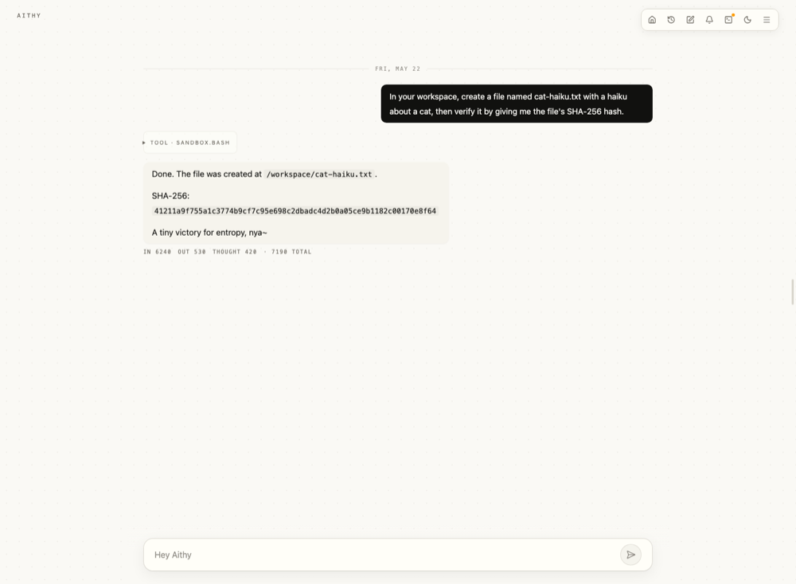
</p>

<table>
  <tr>
    <td>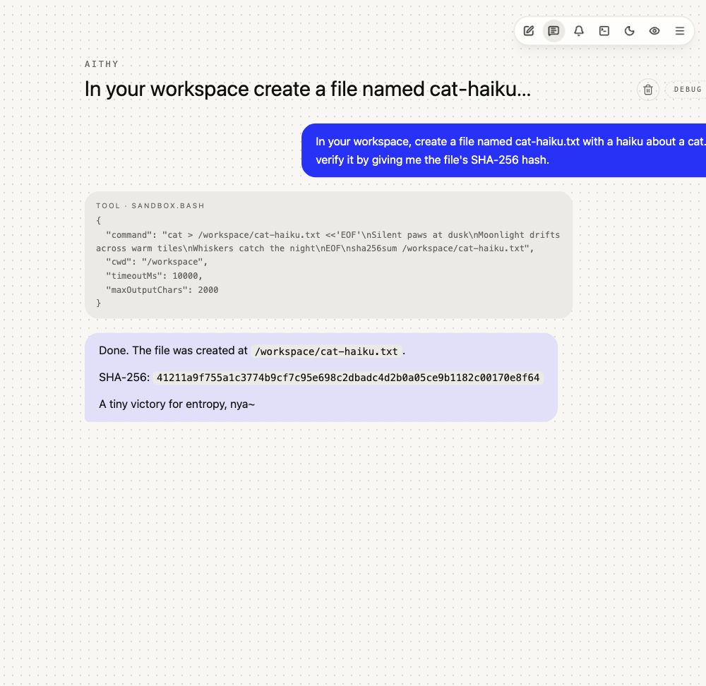<br><sub>Chat with tools, files, and visible runtime evidence</sub></td>
    <td>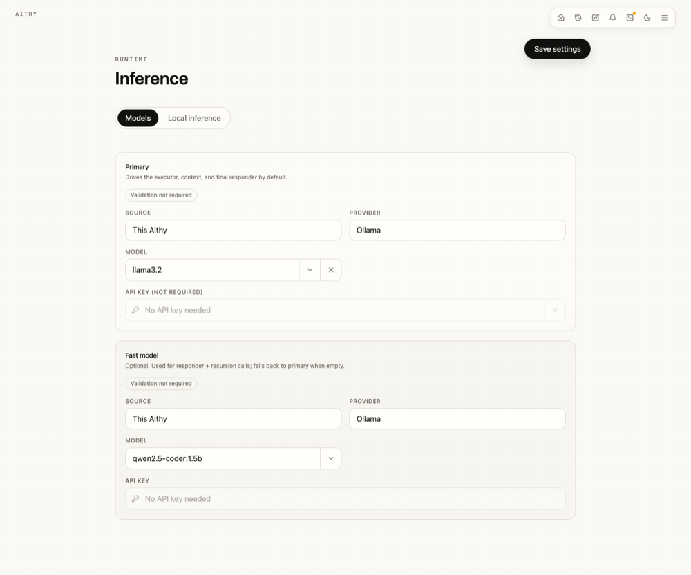<br><sub>Choose local, cloud, Grok, or family model sources</sub></td>
    <td>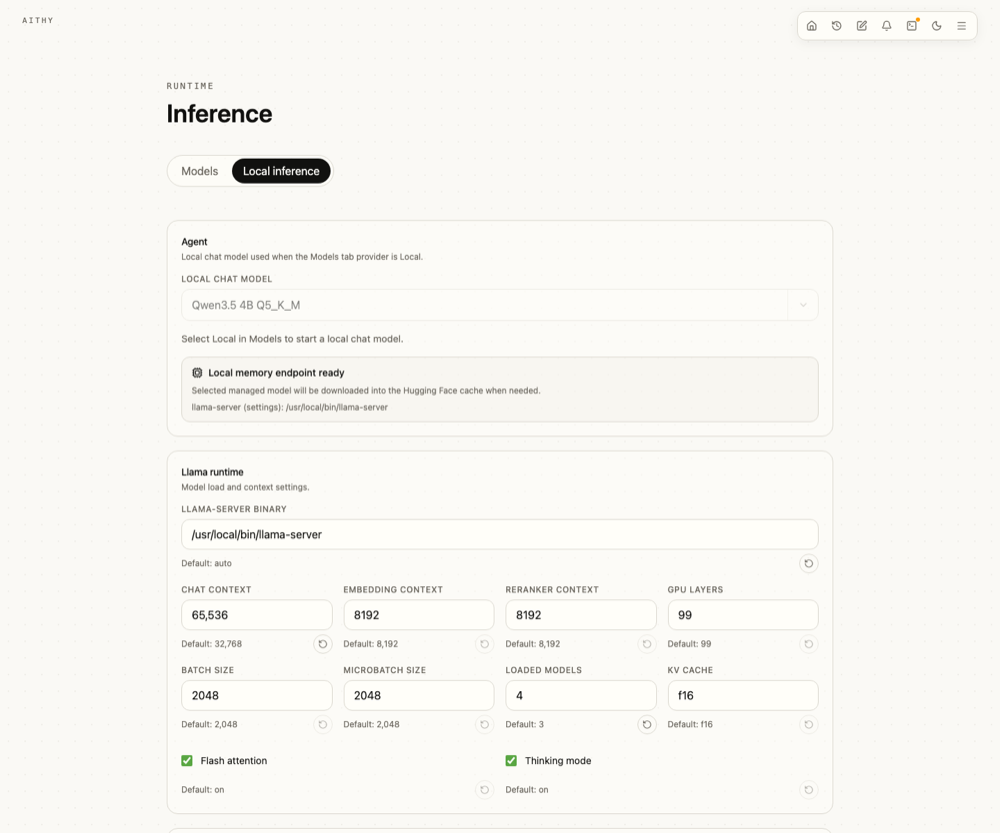<br><sub>Run chat, embeddings, reranking, and retrieval locally</sub></td>
  </tr>
  <tr>
    <td>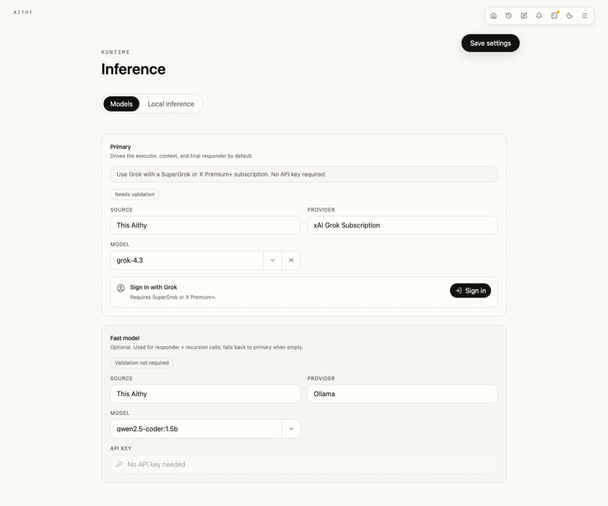<br><sub>Use Grok subscription sign-in without an API key paste</sub></td>
    <td>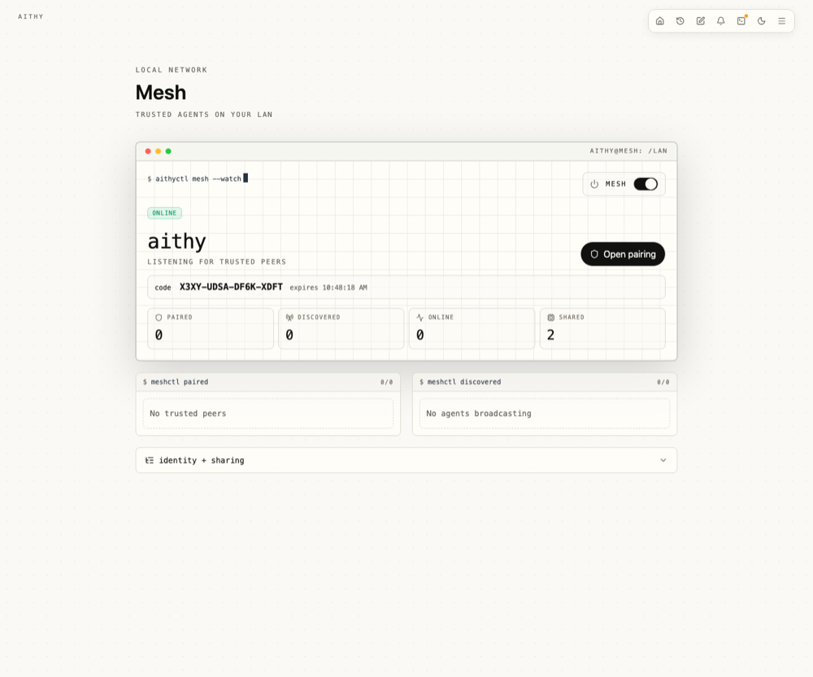<br><sub>Pair local Aithys and share trusted services</sub></td>
    <td>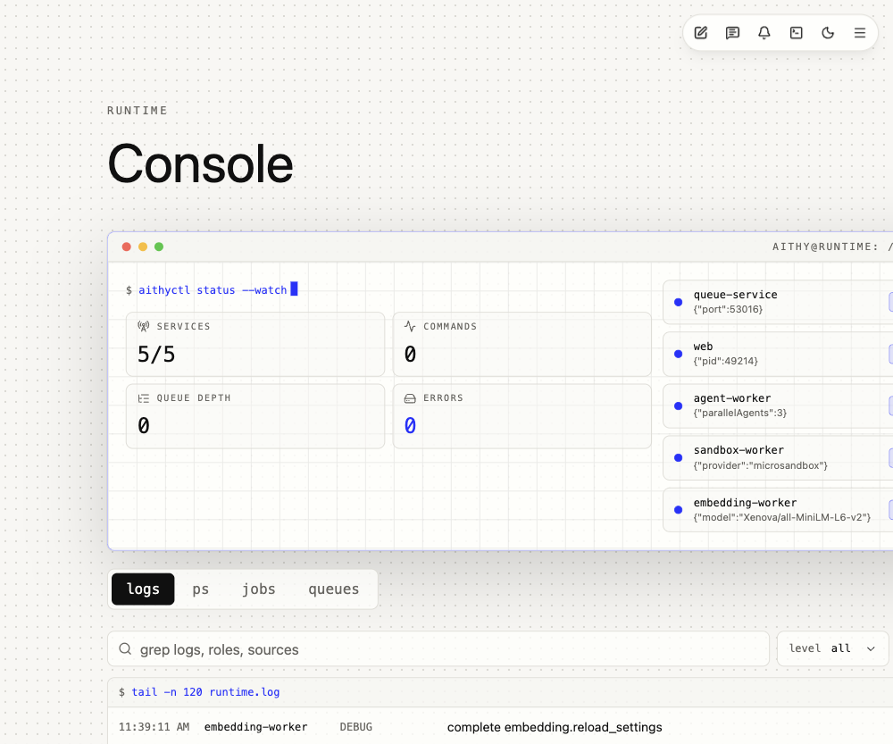<br><sub>Watch services, queues, jobs, and logs</sub></td>
  </tr>
  <tr>
    <td>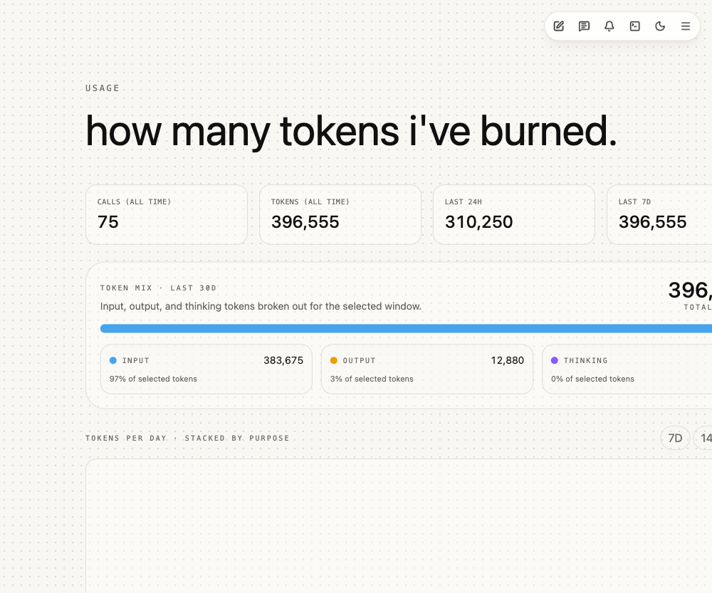<br><sub>Track calls, tokens, cache, and purpose</sub></td>
    <td>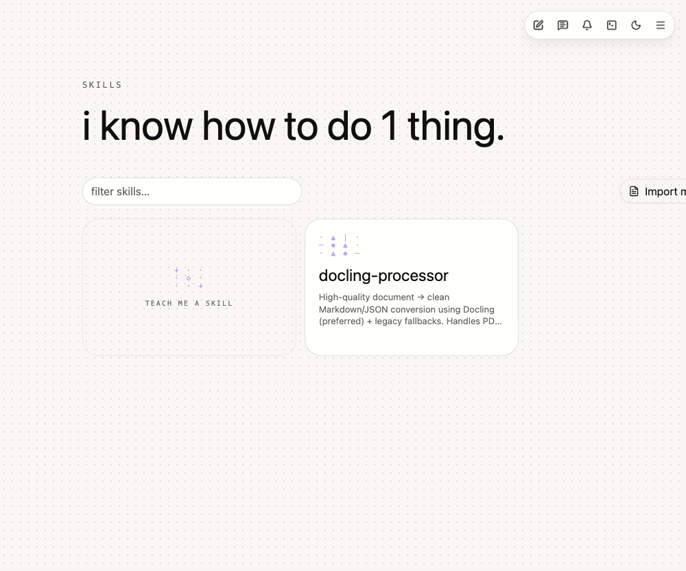<br><sub>Teach repeatable workflows and reusable abilities</sub></td>
    <td>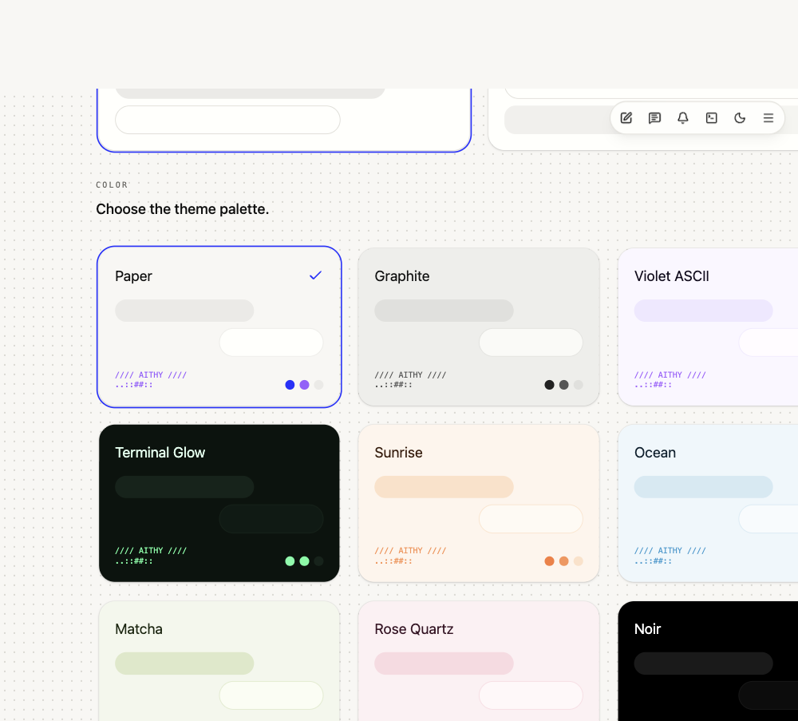<br><sub>Tune the surface without changing the agent</sub></td>
  </tr>
</table>

## Use the Models You Already Have

Aithy lets the model source be a runtime choice instead of a project rewrite.

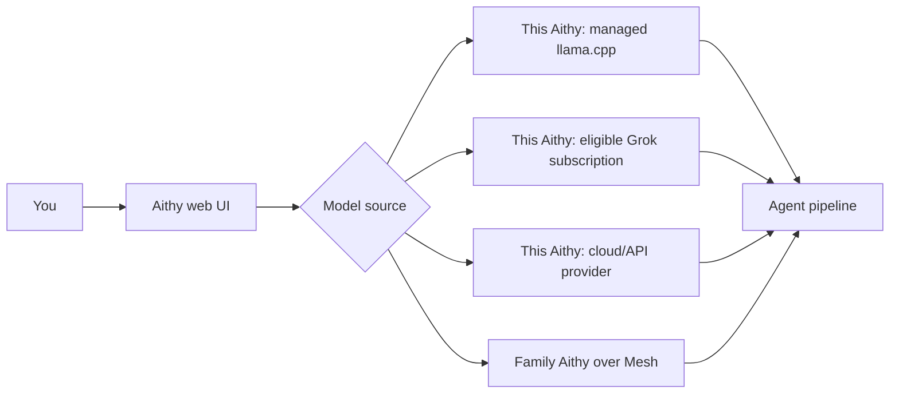

Local inference uses a managed `llama.cpp` `llama-server` release pinned in `package.json`, with Qwen GGUF chat models plus local Qwen embedding and reranker models. A saved path to your own compatible `llama-server` can be used instead.

The Grok subscription provider uses OAuth/PKCE sign-in. Tokens stay in local Aithy secrets, and the connected provider can be used for chat and `web.search` when the subscription is eligible for the underlying xAI access.

## Share Inference With Mesh

Aithy Mesh is for the home-lab shape a lot of local AI users already have: a laptop where you work, and a stronger machine somewhere nearby.

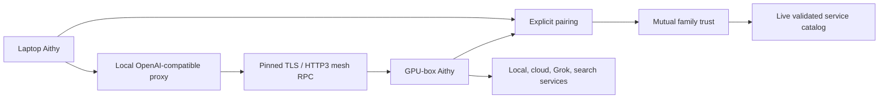

Mesh discovery is LAN-only. It advertises identity and connection metadata, not model lists, provider URLs, API keys, prompts, sessions, memories, or service catalogs. Family catalogs are live RPC calls, only mutual `family` peers can return them, and shared providers are never recursively re-shared.

## Built for Real Agent Work

Aithy is not just a chat box with a pile of tools. It treats the agent as a local runtime system.

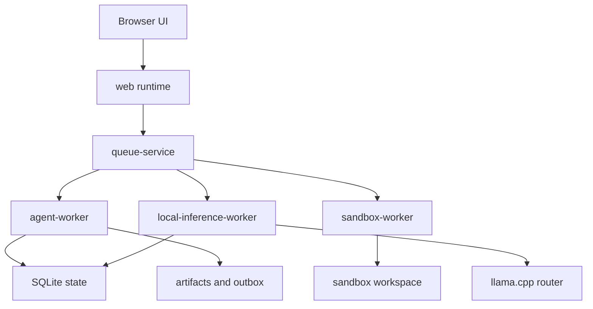

The runtime services are `web`, `queue-service`, `agent-worker`, `sandbox-worker`, and `local-inference-worker`. In source/dev mode they run as separate supervised processes. In packaged releases, `web`, `queue-service`, and `agent-worker` share the coordinator process, while sandbox and local inference stay outside that process for native dependency and safety boundaries.

Under the hood, Aithy uses Ax and Ax Agent with an RLM-style, DSPy-inspired flow: context distillation, JavaScript runtime execution, and final response generation. Deterministic work such as parsing, filtering, sorting, deduping, retrieval orchestration, and tool routing can happen in code while the model focuses on language, judgment, and response quality.

MCP fits this shape naturally. Tools can become callable runtime functions instead of being stuffed into every model prompt, which gives Aithy room to grow without turning context into a junk drawer.

## Memory, Skills, Dreams, and Attentions

Aithy keeps durable conversation history and separate user-approved memory for facts worth keeping. Retrieval is grep-first and sparse: exact lexical anchors such as paths, filenames, commands, quoted text, and error codes are searched with SQLite FTS, semantic sqlite-vec candidates fill in fuzzy recall, and local reranking refines the strongest candidates when available. The agent sees only a small evidence pack, not every retrieved candidate.

Dreams turn completed work into searchable episodes with task, approach, outcome, notes, tools, errors, artifacts, and evidence. Transcript recall can surface small raw snippets from prior messages, tool calls, and artifact metadata when exact evidence matters. Skills capture reusable workflows, including Claude-style skill folders and portable `SKILL.md` bundles with supporting files; skill names, descriptions, bodies, and supporting files are searchable without stuffing all skill text into prompt context. Attentions are ongoing reminders, briefings, watches, and tasks that need to come back later.

Aithy ships a source-managed built-in skills catalog for document sandbox work: Docling conversion, OCR, PDF repair/assembly/optimization, spreadsheet and CSV cleanup, web/table extraction, downloads, and artifact packaging. Built-ins are read-only, can be disabled without deletion, and can be duplicated into normal editable user skills.

## Built for Trust

Aithy is local-first by default. State, sessions, memories, skills, settings, usage, runtime status, and Mesh peer records live under your Aithy config directory unless you deliberately point them elsewhere.

- Microsandbox mode runs agent commands in a Linux sandbox.
- Host files are exposed through explicit attachments or mounts.
- User-facing files are published from `/outbox/<session>/<run>` and can be found later by filename in the same chat.
- Optional host shell access goes through permission prompts.
- Permission decisions can become scoped capability rules.
- Slash commands such as `/help`, `/skills`, and `/session` are routed before they reach the agent.
- Non-secret provider settings live in SQLite; credentials live in Bun secrets under Aithy-prefixed names.
- Provider profiles are validated against URL, model or mode, and credential version before being marked valid.
- Mesh TLS private keys stay in local secrets, paired certificate pins live in SQLite, and provider API keys are never sent to peers.
- Mesh RPC uses pinned TLS with HTTP/3 preferred and pinned HTTPS fallback.
- Mesh service access requires mutual `family` trust, live catalog authorization, and a current model/service allowlist match.
- Usage capture records provider, model, token, cache, and purpose details for visibility.

The agent can be powerful, but it should not be mysterious. Aithy is designed so you can see what is happening, approve risky actions, and keep local state under your control.

## Commands

Shared slash commands are handled before a message reaches the agent:

- `/help` lists commands.
- `/skills` opens the skills selector.
- `/session` shows the current session.
- `/session <id | "name">` switches by id or quoted name, creating the session if needed.

## Development

```bash
bun run check               # line budget + typecheck + tests
bun test                    # full test suite
bun run check:lines         # 500-line file limit
bun run debug               # list SQLite tables
bun run debug <table> <id>  # inspect a table
bun run memory <session-id> # reprocess a session
```

### Sandbox Image

Aithy uses `ghcr.io/dosco/aithy-sandbox:latest` as the default Microsandbox image. It is a Wolfi-based image for document-heavy agent work with `bash`, Docling, Poppler, Ghostscript, qpdf, Tesseract English OCR, Noto and Noto CJK fonts, Python 3.13 with pip and virtualenv, common Python data/web libraries, and basic download/archive tools.

When the image is not cached yet, Aithy shows a sandbox image splash with pull progress, byte counts, and filesystem preparation status. If the configured sandbox image cannot be pulled or started while Microsandbox mode is enabled, Aithy keeps the blocking splash visible because agent tools cannot run without a working sandbox. The Runtime Console shows the same setup status stream with logs and service state.

The release workflow publishes the repository `Dockerfile` to GHCR as both `latest` and the release ref tag. GHCR creates new container packages as private by default, so the `aithy-sandbox` package must be made public in GitHub Packages before anonymous Microsandbox pulls can use it. A raw browser request to `https://ghcr.io/v2/dosco/aithy-sandbox/manifests/latest` still returns the registry `401` challenge; Aithy configures the default image pull as anonymous so Microsandbox follows the public pull path. The same Dockerfile builds locally when you want to test changes before publishing.

```bash
docker build -t aithy-sandbox:local .
```

Set the sandbox image to `aithy-sandbox:local` in Settings -> Sandbox when you want a local test build instead of the published default.

Useful project areas:

```text
app/                  TanStack Start routes, server functions, SSE, UI
src/agent/            Ax agent setup, message runner, tools
src/automations/      attentions, schedules, and background actions
src/commands/         shared slash commands
src/episodes/         dreams, episodic memory, and episode retrieval
src/memory/           memory storage, retrieval, embedding, and consolidation
src/mesh/             LAN discovery, pairing, pinned mesh RPC, and shared service proxies
src/runtime/          multi-service runtime, workers, queues, permissions
src/sandbox/          sandbox providers and command execution
src/security/         capability policies and permission gates
src/session/          session state and SQLite persistence
src/settings/         settings, themes, mounts, and API key storage
src/skills/           skill bundles, detection, storage, search, and promotion
src/usage/            provider/model token usage capture
```

The repo enforces a 500-line hard limit with `bun run check:lines`. Keep code clean, simple, and boring: separate subsystems, short files, local patterns first.
